# Part 1: Prepare base model for ArcFace
## Step 1: Data compression
```bash
python -m mxnet.tools.im2rec --list --recursive train <dataset_path> # list the images in the dataset

python -m mxnet.tools.im2rec train.lst <dataset_path> # create the record file
```
- path of dataset: /media/avlab/8TB/Michael/arcface_torch_LR_50/gradeuate/dataset/images/RepSet_X_7 #on 1601191353
* [ x ] Dataset compression completed, and .rec, .list, and .idx files have been obtained.

## Step 2: Set the config file
- config.py: RepSet_X_7.py

## Step 3: Train the base model
```bash
python train_v2.py configs/config/<config.py>
```
Validation while training. Also shows the validation accuracy, you can only force on 'Accuracy-Highest' value.

- config.py: RepSet_X_7.py
## Step 4: Validation
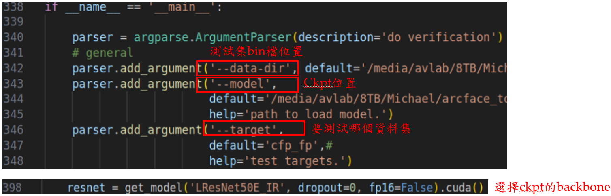
```bash
python verification_torch.py
```
# Part 2: AdaDistillation
## Step 1: Data compression
```bash
python -m mxnet.tools.im2rec --list --recursive train <dataset_path> # list the images in the dataset

python -m mxnet.tools.im2rec train.lst <dataset_path> # create the record file
```
- path of dataset: /media/avlab/8TB/Michael/arcface_torch_LR_50/gradeuate/dataset/images/RepSet_X_7 #on 1601191353
* [ x ] Dataset compression completed, and .rec, .list, and .idx files have been obtained.
## Step 2: Set the config file
- config.py: RepSet_X_7.py
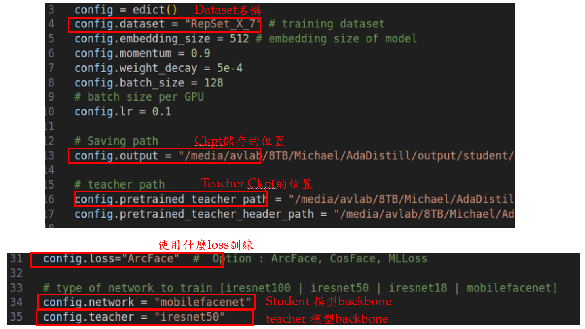

## Step 3: Train the AdaDistillation model
```bash
bash run_AdaDistill.sh # Backbone used for test value. Header used for train resume.
```
# Part 3: DMD(Dual Modal Diffusion)
## Step 1: Data location
- CAF-Aug: /media/avlab/disco/Michael/CAF_dataset/Cross_Age_Face_crop_age_aug_label # on 1601191353
- Vox2-LP: /media/avlab/disco/Michael/vox2/vox2_label # on 1601191353
## Note:
### Age label:
- MiVOLO Path: /media/michaeljison/2TB/Michael/MiVOLO # on 1414974416
- Usage: python label_age.py --input <dataset_path> --detector-weights <yolo_ckpt_path> --checkpoint <mivolo_ckpt_path>
##### Example:
```bash
python label_age.py --input /media/michaeljison/2TB/caf_age_ana/output/caf_50-69 --detector-weights /media/michaeljison/2TB/Michael/MiVOLO/models/yolov8x_person_face.pt --checkpoint /media/michaeljison/2TB/Michael/MiVOLO/models/mivolo_imbd.pth.tar
```
### Angle label:
- Path: /media/michaeljison/2TB/Michael/cal_reggie_metrics # on 1414974416
- Usage: python label_angle.py
#### Label logic: <folder_name>_<num_img>_<yaw>_<age_mivolo>.jpg

## Step 2: Train the DMD model
```bash
bash train.sh 
```
Datamodule path :/media/avlab/8TB/Michael/dcface/dcface/src/configs/datamodule/caf.yaml
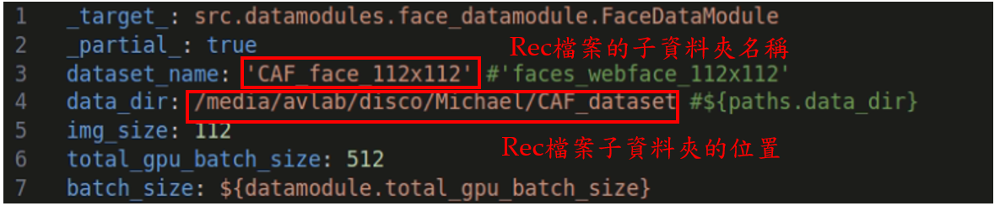

## Step 3: Inference
- Path: /media/avlab/8TB/Michael/dcface/dcface/src
```bash
bash synthesis.sh
```
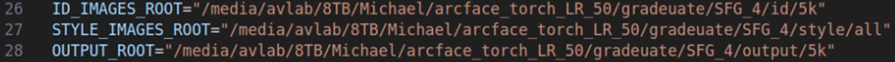
ID_IMAGES_ROOT: ID images path (without subfolders, only ID)
STYLE_IMAGES_ROOT: style images path(with subfolder, also ID corresponding with images) 
OUTPUT_ROOT: output path

## Supplementary
### all pose and age transformation ckpt locations
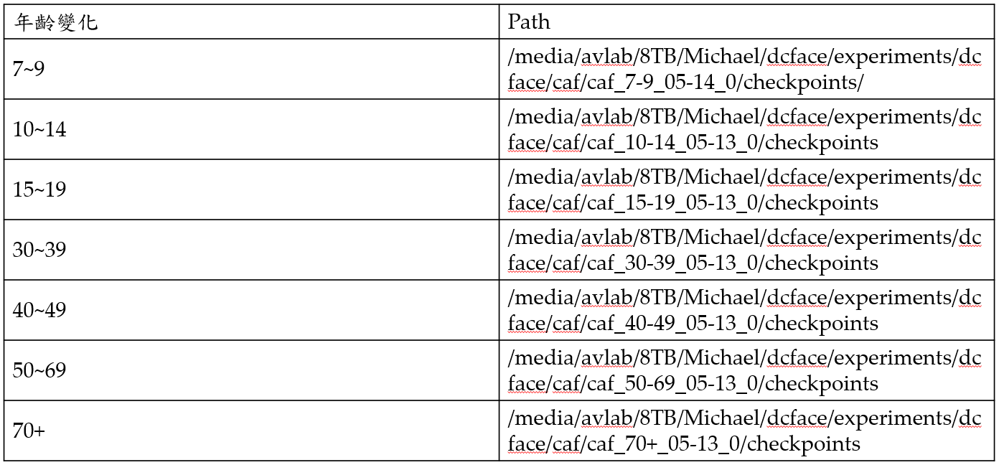

### DEMO code
- Path: /media/avlab/8TB/Michael/dcface/dcface # on 1601191353
```bash
python app.py
```
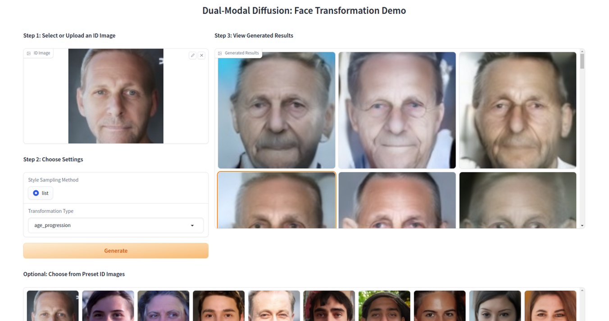
#### Details:

# Part 4: SFG(Source Face Generator)
## Step 1: LLM api call
- Path: /media/avlab/8TB/Michael/Janus # on 1601191353
```bash
python janus_rag_estimator.py
python gpt_rag_estimator.py
```
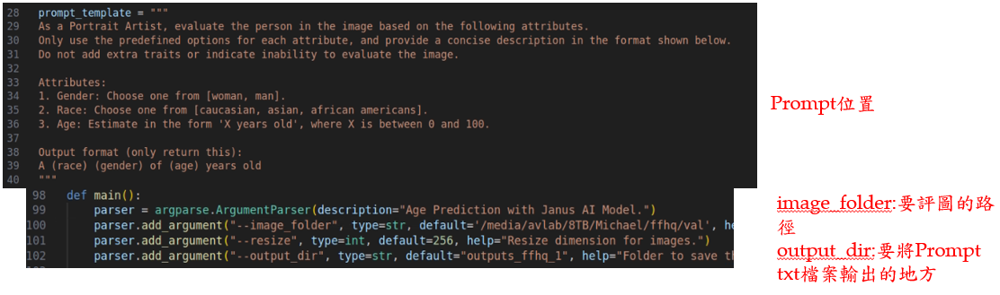
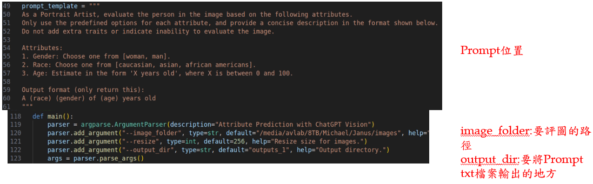
### Output:
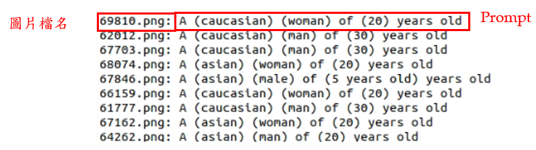
## Step 2: Add additional information
```bash
python add_country.py
```

## Step 3: Generate canny edge image
```bash
python canny.py
```
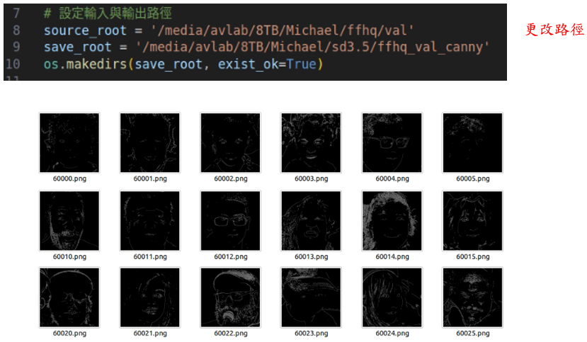
## Step 4: Generate source face
```bash
python sd3_infer.py --prompt=Prompt <txt path> --controlnet_cond_image=<mapped canny image path> --controlnet_ckpt=controlnet<weight path> --out_dir=<output path> 
```
##### Example:
```bash
python sd3_infer.py --prompt=/media/avlab/8TB/Michael/Janus/outputs_ffhq/predictions_random_country.txt --controlnet_cond_image=/media/avlab/8TB/Michael/sd3.5/ffhq_val_canny --controlnet_ckpt=models/sd3.5_large_controlnet_canny.safetensors --out_dir=outputs/sd3.5_large_canny
```
# Part 5: DCFace ID Generator
## Step 1: Generate ID images
 - Path: /media/avlab/8TB/Michael/dcface/dcface/stage1/unconditional_generation # 1601191353
```bash
python unconditional_sampling.py --attention_resolutions 16 --class_cond False --diffusion_steps 1000 --num_samples 16 --batch_size 8 --image_size 256 --learn_sigma True --noise_schedule linear --num_channels 128 --num_head_channels 64 --num_res_blocks 1 --resblock_updown True --use_fp16 False --use_scale_shift_norm True --timestep_respacing 100 --down_N 32 --range_t 20 --save_dir unconditional_samples
```
## Step 2: Align Faces
 - Path: /media/avlab/8TB/Michael/dcface/dcface/stage1/align_faces
```bash
python main.py --root ../unconditional_generation/unconditional_samples --save_root ../unconditional_generation/unconditional_samples_aligned
```
## ID image path:
 - 526696407

 - 1414974416
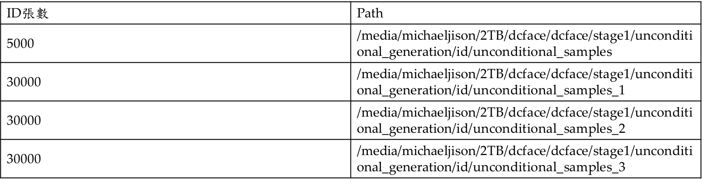
# Part 6: Intra-class Distribution
