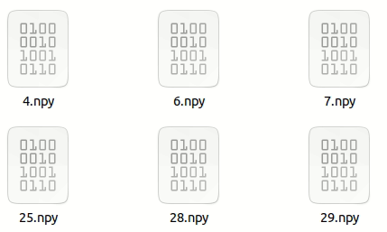

# Part 9: Data Augmentation
## Pose Augmentation
### Using [Vec2Face](https://github.com/HaiyuWu/Vec2Face.git) for Pose Augmentation
- Step 1: extract features - using [SOTA-Face-Recognition-Train-and-Test](https://github.com/HaiyuWu/SOTA-Face-Recognition-Train-and-Test.git)
    - `python img2txt.py`
    - download the pre-trained model from [Model_zoo](https://github.com/HaiyuWu/SOTA-Face-Recognition-Train-and-Test/tree/main/model_zoo), then put the model in `model/`
    -  `python3 feature_extractor.py --model_path model/<model_name> --model iresnet --depth 100 --image_paths /Path/To/id_path.txt --destination <destination_folder>`

    

- Step 2: generate images - using [Vec2Face](https://github.com/HaiyuWu/Vec2Face.git)
    - `python generate.py --model_path model/<model_name> --input_path <input_folder> --output_path <output_folder>`
