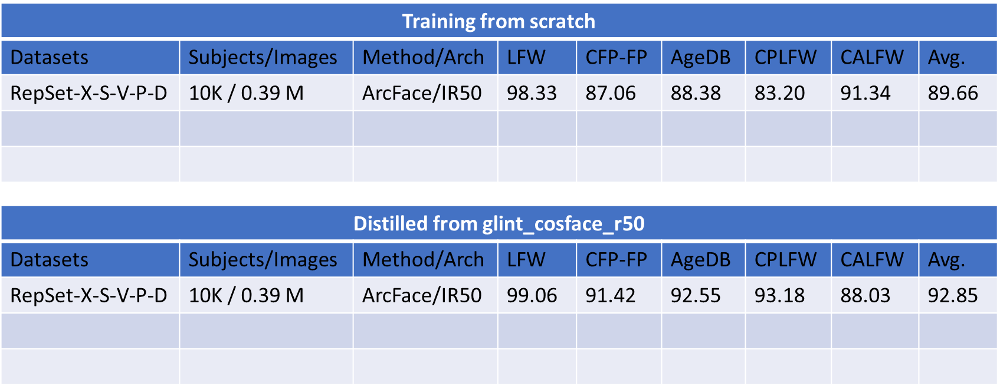

## Note:
- RepSet_X_15的ID: /media/avlab/8TB/Michael/arcface_torch_LR_50/gradeuate/dataset/images/reduce_size/RepSet_X_15_id
- 除了DMD之外，也可以用vec2face擴充，就是用上面的ID然後用vec2face的生成器生成: /media/avlab/8TB/Michael/Vec2Face
## Vec2face - [github](https://github.com/HaiyuWu/Vec2Face)
```bash
python image_generation_with_reference.py --image_file "path/of/the/image/file or folder" --model_weights weights/vec2face_generator.pth --batch_size 5 --example 10 --name images-of-references
```
- Best dataset: /media/avlab/8TB/Michael/arcface_torch_LR_50/gradeuate/dataset/images/reduce_size/RepSet_X_15_vec2face_pose #Augmentation with DMD & vec2face
