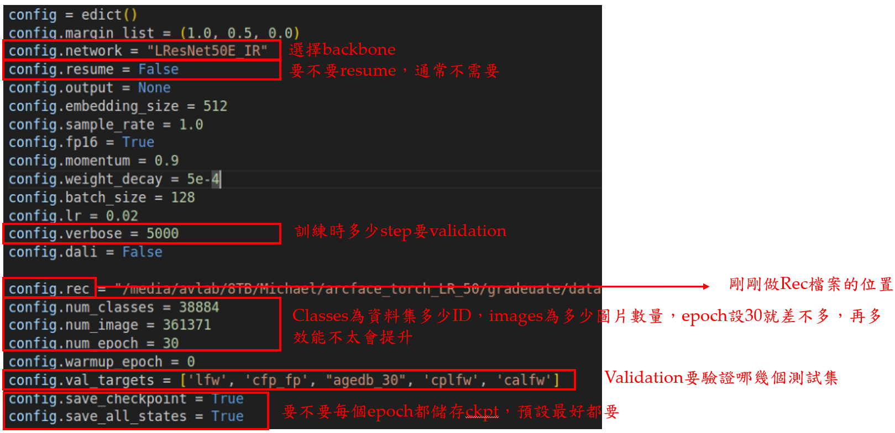
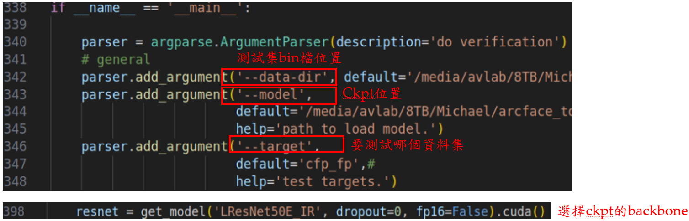

# Part 1: Prepare base model for ArcFace

## Step 1: Data compression
```bash
python -m mxnet.tools.im2rec --list --recursive train <dataset_path>  # list the images in the dataset
python -m mxnet.tools.im2rec train.lst <dataset_path>                 # create the record file
```
- Path of dataset: /media/avlab/8TB/Michael/arcface_torch_LR_50/gradeuate/dataset/images/RepSet_X_7 #on 1601191353
- [ x ] Dataset compression completed, and .rec, .list, and .idx files have been obtained.

## Step 2: Set the config file
- `config.py`: `RepSet_X_7.py`



## Step 3: Train the base model
```bash
python train_v2.py configs/config/<config.py>
```
Validation while training also shows the validation accuracy; focus on 'Accuracy-Highest' value.

## Step 4: Validation

```bash
python verification_torch.py
```
