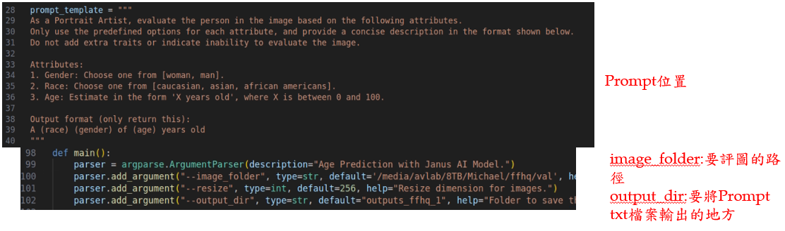
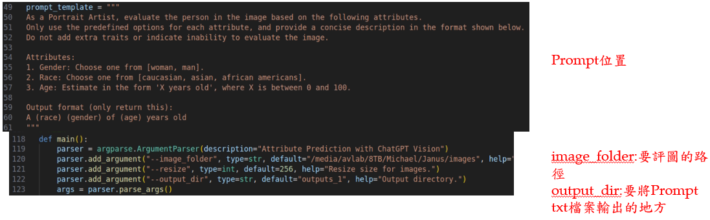
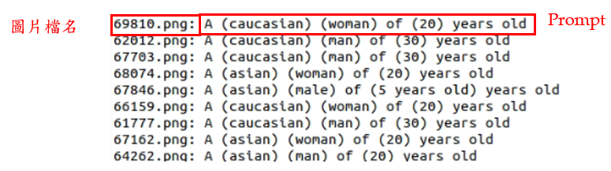
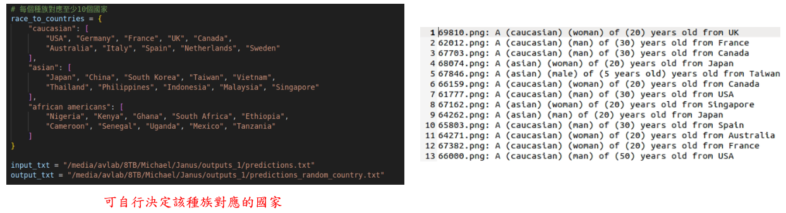
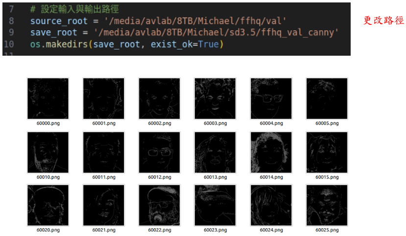

# Part 4: SFG(Source Face Generator)
## Step 1: LLM api call
- Path: /media/avlab/8TB/Michael/Janus # on 1601191353
```bash
python janus_rag_estimator.py
python gpt_rag_estimator.py
```


### Output:

## Step 2: Add additional information
```bash
python add_country.py
```

## Step 3: Generate canny edge image
```bash
python canny.py
```

## Step 4: Generate source face
```bash
python sd3_infer.py --prompt=Prompt <txt path> --controlnet_cond_image=<mapped canny image path> --controlnet_ckpt=controlnet<weight path> --out_dir=<output path> 
```
##### Example:
```bash
python sd3_infer.py --prompt=/media/avlab/8TB/Michael/Janus/outputs_ffhq/predictions_random_country.txt --controlnet_cond_image=/media/avlab/8TB/Michael/sd3.5/ffhq_val_canny --controlnet_ckpt=models/sd3.5_large_controlnet_canny.safetensors --out_dir=outputs/sd3.5_large_canny
```