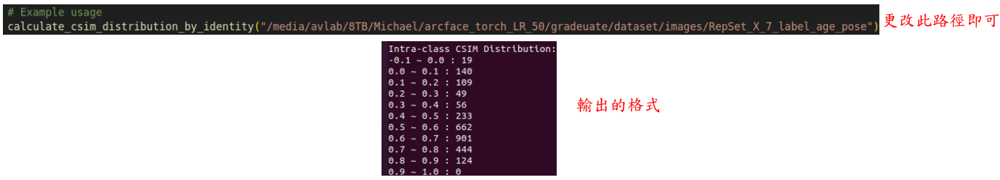

# Part 6: Intra-class Distribution
## Situation 1: POE + 3DDFA method
### If you don't have the angle labels, you can use the following script to label them.
- First, discriminate the angle by 3ddfa.
- Then, use the proper POE encoder to calculate the intra-class distribution.
- It will take a long time to run, because it needs to calculate the angle for each image. Finally, it will generate the CSIM between the image and center.

- Path: /media/avlab/8TB/Michael/cal_metrics_reggie # on 1601191353
```bash
python mean_poe_intra_class_3ddfa.py #calculate intra-class distribution 
```
## Situation 2: POE method
### If you have the angle labels, you can use the following script to calculate the CSIM between the images and the center. It will 10x faster than the **Situation 1**.

- Path: /media/avlab/8TB/Michael/cal_metrics_reggie # on 1601191353
```bash
python mean_poe_intra_class.py #calculate intra-class distribution
```

## Situation 3: POE method based on ID
### If you have the angle labels, you can use the following script to calculate the CSIM between the images and the center. It will 10x faster than the **Situation 1**. 
 - Based on ID means that the intra-class distribution will be calculated by averaging the intra-class distribution of each identity. 

- Path: /media/avlab/8TB/Michael/cal_metrics_reggie # on 1601191353
```bash
python mean_poe_intra_class_id.py #calculate intra-class distribution
```