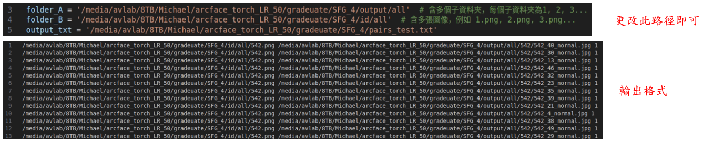
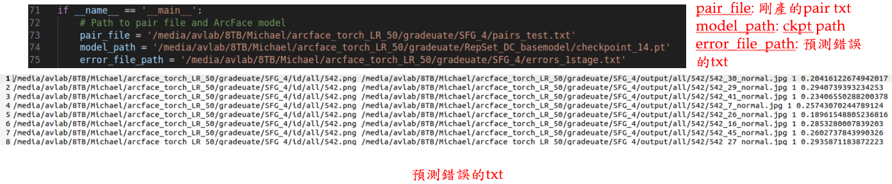
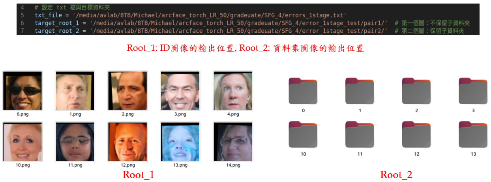

# Part 7: FRS (Find the Representative Samples)
## Step 1: Data preprocessing
- Path: /media/michaeljison/2TB/AdaFace　# on 1601191353
### Using the AdaFace model to scan all images in the specified path, comparing each image with others. If the CSIM exceeds 0.3, they are grouped into the same folder, indicating they belong to the same identity.

```bash
python inference_v2.py
```
## Step 2: Find the representative samples
follow these steps:
- Pairing
- Finding effective samples
- Copying failure samples
- Pairing failure samples
- Verifying failure pairs with model
### Pairing samples
- Path: /media/avlab/8TB/Michael/arcface_torch_LR_50/gradeuate/code # on 1601191353

```bash
python pairs.py
```
### Finding effective samples
- Path: /media/avlab/8TB/Michael/arcface_torch_LR_50 # on 1601191353

```bash
python inference_csim_pair.py
```
### Copying failure samples
- Path: /media/avlab/8TB/Michael/arcface_torch_LR_50/gradeuate/code

```bash
python copy_1.py
```
### Pairing failure samples
- Path: /media/avlab/8TB/Michael/arcface_torch_LR_50/gradeuate/code

```bash
python pairs.py
```
### Verifying failure pairs with model
- Path: /media/avlab/8TB/Michael/arcface_torch_LR_50/gradeuate/code
```bash
python verify.py
```
### Get the final representative samples
- First, using **pairs.py** to create image pairs from the misclassified images and save the results in pair.txt. \
Next, running **inference_csim_pair.py** to re-verify these pairs, which produces another .txt file listing misclassified images.
However, these misclassified images are not the ones we actually need — what we want are cases where the real model predicts correctly, but the synthetic model predicts incorrectly.
Therefore, we use **delete.py** to remove the undesired misclassified images, leaving only the truly valid samples.
```bash
python delete.py
```
