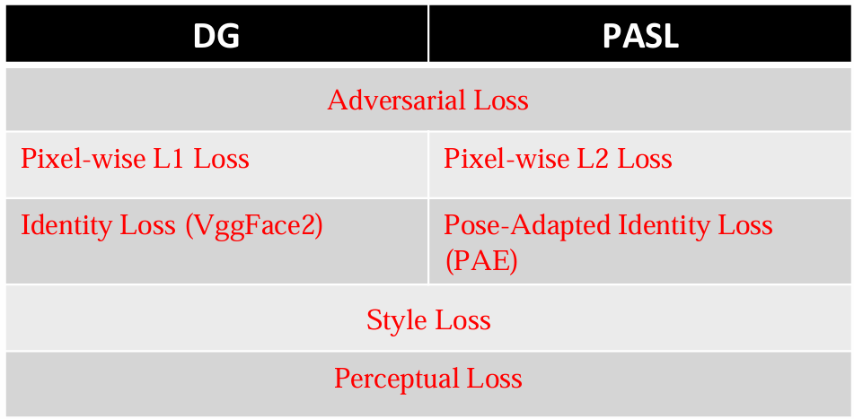
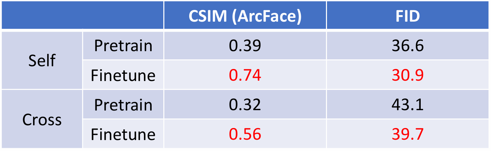

# Part 8: DG&PASL
## Architecture comparison
### DG (Dual-Generator, CVPR 2022) [DG_cvpr_link](https://openaccess.thecvf.com/content/CVPR2022/html/Hsu_Dual-Generator_Face_Reenactment_CVPR_2022_paper.html)& PASL (Pose Adapted Shape Learning, CVPR 2024) [PASL_cvpr_link](https://openaccess.thecvf.com/content/CVPR2024/html/Hsu_Pose_Adapted_Shape_Learning_for_Large-Pose_Face_Reenactment_CVPR_2024_paper.html)
- DG's Generator is StarGANv2, while PASL adds a Transformer. The loss functions differ in Pixel-wise loss and ID Loss, while the rest remain the same.

## DG (Dual-Generator)
- Path: /media/avlab/8TB/DG_New # on 1601191353
### Vox1 configurations
- Vox1 Pretrained 200k
位置: 1601191353
 /media/avlab/8TB/DG_New/FRG/expr_reggie/vox1_self
 Vox1 Finetune 204k
位置: 1601191353
 /media/avlab/8TB/DG_New/FRG/expr_reggie/vox1_self_finetune_16
 Train List:
 /media/avlab/8TB/DG_New/FRG/train_list/train_list_vox1_clean_1201_id.txt
 Finetune List:
 /media/avlab/8TB/DG_New/FRG/train_list/finetune_list_vox1_new_16_809_clean.txt
 Test List:
 /media/avlab/8TB/DG_New/FRG/train_list/vox1_cross_test_clean.txt
 /media/avlab/8TB/DG_New/FRG/train_list/test_self_vox1_clean.txt
 
### Vox2 configurations
-  Vox2 Pretrained 123k
位置: 1601191353
 /media/avlab/8TB/DG_New/FRG/checkpoint/vox2_dg_new
 Vox2 Finetune 140k
位置: 1601191353
 /media/avlab/8TB/DG_New/FRG/checkpoint/vox2_dg_new
 Train List:
 /media/avlab/8TB/DG_New/FRG/train_list/nVox2_self_train_reggie.txt
 Finetune List: 
/media/avlab/8TB/DG_New/FRG/train_list/nVox2_fintune_20.txt
 Test List:
 /media/avlab/8TB/DG_New/FRG/train_list/nVox2_test_cross_new_limited.txt
 /media/avlab/8TB/DG_New/FRG/train_list/nVox2_self_test_new_limited.txt
 
### MPIE-LP configurations
-  MPIE-LP Pretrained 195k
位置: 1601191353
 /media/avlab/8TB/RFG_DECA_Trans/expr_reggie/mpie_new_finetune_self
 MPIE-LP Finetune 250k
位置: 1601191353
 /media/avlab/8TB/RFG_DECA_Trans/expr_reggie/mpie_new_finetune_self
 Train List:
 /media/avlab/8TB/RFG_DECA_Trans/train_list/mpie_self_train_cvpr_reggie.txt
 Finetune List:
 /media/avlab/8TB/RFG_DECA_Trans/train_list/mpie_self_finetune_cvpr_32.txt
 Test List:
 /media/avlab/8TB/RFG_DECA_Trans/train_list/train_list/mpie_self_test_cvpr_reggie.txt
 /media/avlab/8TB/RFG_DECA_Trans/train_list/train_list/mpie_cross_test_cvpr_reggie.txt
 

## PASL (Pose Adapted Shape Learning for Large-Pose Face Reenactment)
- Path: /media/avlab/8TB/RFG_DECA_Trans
### Vox1 configurations
- Vox1 Pretrained 350k
位置: 1601191353
 /media/avlab/8TB/RFG_DECA_Trans/expr_reggie/pasl_vox1_self_finetune16_350k
 Vox1 Finetune 354k
位置: 1601191353
 /media/avlab/8TB/RFG_DECA_Trans/expr_reggie/pasl_vox1_self_finetune16_350k
 Train List:
 /media/avlab/8TB/RFG_DECA_Trans/train_list/train_list_vox1_clean_1201_id.txt
 Finetune List:
 /media/avlab/8TB/RFG_DECA_Trans/train_list/finetune_list_vox1_new_16_809_clean.txt
 Test List:
 /media/avlab/8TB/RFG_DECA_Trans/train_list/train_list/vox1_cross_test_clean.txt
 /media/avlab/8TB/RFG_DECA_Trans/train_list/train_list/test_self_vox1_clean.txt

### Vox2 configurations
- Vox2 Pretrained 350k
位置: 1601191353
 /media/avlab/8TB/RFG_DECA_Trans/expr_reggie/pasl_vox2_self
 Vox2 Finetune 350k
位置: 1601191353
 /media/avlab/8TB/RFG_DECA_Trans/expr_reggie/pasl_vox2_self
 Train List:
 /media/avlab/8TB/RFG_DECA_Trans /train_list/nVox2_self_train_reggie.txt
 Finetune List: 
/media/avlab/8TB/RFG_DECA_Trans /train_list/nVox2_fintune_20.txt
 Test List:
 /media/avlab/8TB/RFG_DECA_Trans /train_list/nVox2_test_cross_new_limited.txt
 /media/avlab/8TB/RFG_DECA_Trans /train_list/nVox2_self_test_new_limited.txt

### MPIE-LP configurations
- MPIE-LP Pretrained 195k
位置: 1601191353
 /media/avlab/8TB/RFG_DECA_Trans/expr_reggie/mpie_new_finetune_self
 MPIE-LP Finetune 250k
位置: 1601191353
 /media/avlab/8TB/RFG_DECA_Trans/expr_reggie/mpie_new_finetune_self
 Train List:
 /media/avlab/8TB/RFG_DECA_Trans/train_list/mpie_self_train_cvpr_reggie.txt
 Finetune List:
 /media/avlab/8TB/RFG_DECA_Trans/train_list/mpie_self_finetune_cvpr_32.txt
 Test List:
 /media/avlab/8TB/RFG_DECA_Trans/train_list/train_list/mpie_self_test_cvpr_reggie.txt
 /media/avlab/8TB/RFG_DECA_Trans/train_list/train_list/mpie_cross_test_cvpr_reggie.txt

